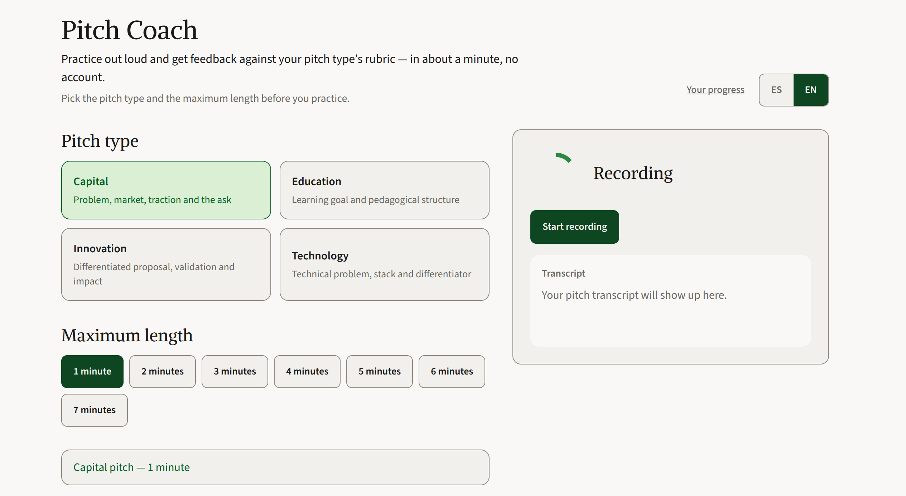
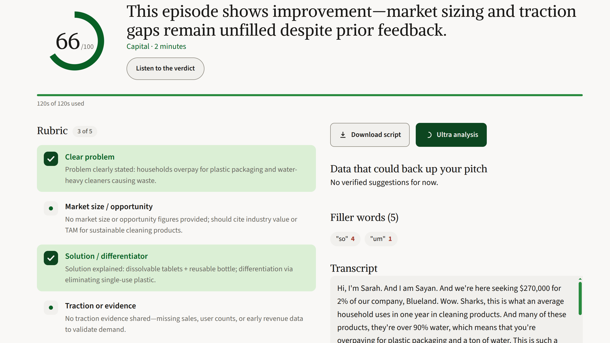
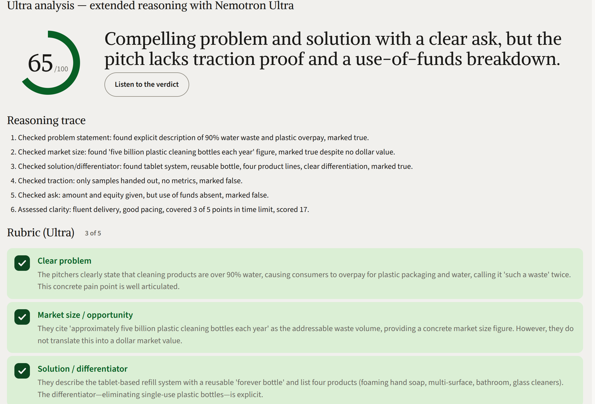

# Pitch Coach

Practice a pitch out loud and get structured feedback for the type you chose
(capital, education, innovation, or technology): a rubric, a score, filler
words, and a verdict you can listen to when you want. The interface and the
analysis run in **Spanish or English** (LATAM-first).

Open source: use it, fork it, and keep going.

License: [MIT](LICENSE).

Live demo: [https://pitch-coach.focampo.com](https://pitch-coach.focampo.com).

Product and implementation docs: [`docs/README.md`](docs/README.md).

## What a session does

**Main loop:** choose language, type, and duration → record (MediaRecorder,
automatic cutoff) → the server transcribes (ElevenLabs Scribe) → filler words
are counted → the model judges the take against the rubric (Nebius by default)
→ the dashboard shows the score, covered and missing points, and the highlighted
transcript.

**Same session, after the score:**

- **Downloadable script** with a timestamp per sentence (`[mm:ss.cc]`) when the
  pitch was recorded (not when it was typed).
- **Listen to the verdict** (ElevenLabs; SpeechSynthesis is the fallback).
- **Public room** — one sourced objection on the first missed point. The room
  follows the type: investment panel, classroom, innovation committee, or
  technical buyer. The five rubric ids do not change.
- **Figures you said** — if the pitch already stated a figure, Tavily looks for
  a source of the same order. If none is found, the dashboard says so and does
  not penalize the point.
- **Where the time went** — when Scribe returned word timestamps, covered
  points are placed on the audio.
- **Second take** — 45 seconds on one missed point. If it is covered, this
  browser remembers the point id and does not store the retake text.
- **Ultra analysis** — opt-in re-analysis with an extended-reasoning trace.
- **Resolve findings** — up to 3 follow-up questions on missed points (voice or
  backup text).
- **Cited figures** (Tavily) for up to two missed rubric points, with a
  sentence ready to say out loud.
- **Your progress** — local history (last 20 practices in this browser),
  including which points closed or opened versus the previous practice of the
  same type and language.

The live indicator is a ring that reacts to the voice and sits with the status
lines (`Listening…` / `Transcribing…` / the closing line), in the session
language. The session is anonymous. There is no login.

## Screenshots

| Pitch setup | Coach (indicator) | Result dashboard |
| :---: | :---: | :---: |
|  |  |  |

## Known limits

- **Unit tests, not UI tests** — `npm test` (vitest) covers `src/lib/` and API
  routes (mocked fetch). The microphone loop is checked by hand.
- **Anonymous session** — history lives in `localStorage`. There are no
  accounts and no sync across devices.
- **STT** — needs `ELEVENLABS_API_KEY` (Scribe). Without it, or without a
  microphone, there is a backup text field.
- **Transcription is not live** — record → stop → transcribe the whole clip.
- **Visual coach** — a live ring (no glowing orb) that reacts to the audio and
  settles as the score. Status lines sit with it.
- **External providers** — Nebius, ElevenLabs, and Tavily have rate limits and
  need a network. TTS falls back to SpeechSynthesis if ElevenLabs fails.

## Stack

- **Next.js 16** (App Router + API routes), **React 19**, **Tailwind CSS 4**
- **Nebius Token Factory** — default analysis (`MODEL_PROVIDER=nebius`)
- **Gemini API** — manual fallback (`MODEL_PROVIDER=gemini`)
- **MediaRecorder + ElevenLabs Scribe** — capture and server-side STT
- **ElevenLabs** — TTS (verdict and finding questions)
- **Tavily** — optional dashboard enrichment
- **Sentry** — errors and tracing (optional; see `.env.example`)
- **Railway** — deploy (`Dockerfile` is production only)

## How the models run

**Token Factory (NVIDIA, on every practice).** The server calls
`https://api.tokenfactory.nebius.com/v1/chat/completions` from
`src/lib/proveedor-nebius.ts`. Nemotron is used in three sizes:

- Take analysis: `nvidia/nemotron-3-super-120b-a12b` (Super).
- Ultra analysis, only if the user asks: `nvidia/Nemotron-3-Ultra-550b-a55b`.
- Sparring, entities, the search query, suggestion checks, the room objection,
  the spoken-figure check, the timeline, and the second take:
  `nvidia/NVIDIA-Nemotron-3-Nano-30B-A3B` (Nano).

The model does not set the score. The rubric lives in `src/lib/rubricas.ts`;
the server derives the score and counts filler words. Detail:
[`docs/guia-integracion-nebius.md`](docs/guia-integracion-nebius.md).

**Tavily.** Search and extract run on the server (`src/lib/tavily.ts`,
`POST /api/enriquecer`). The transcript is not sent. At most two points per
practice receive a figure (`MAX_PUNTOS_ENRIQUECIDOS`). The same call brings one
room objection for the type and checks one figure the pitch already said. If a
missed point has no usable figure, there is no suggestion. If a spoken figure
has no source of the same order, the dashboard says so and does not penalize
the point. Detail:
[`docs/guia-integracion-tavily.md`](docs/guia-integracion-tavily.md).

The app calls Token Factory at runtime. Gemini remains a manual fallback
(`MODEL_PROVIDER=gemini`) and is not the demo path.

## Local setup

Native development on Linux. Docker is not part of the daily loop.

1. Clone the repository.
2. `npm install`
3. Copy `.env.example` to `.env.local` and set at least:
   - `MODEL_PROVIDER` — `nebius` (default) or `gemini`
   - `NEBIUS_API_KEY` — **required** with Nebius (the default). Token Factory key.
   - `GEMINI_API_KEY` — **required** only if `MODEL_PROVIDER=gemini`
4. Optional, for the full loop:
   - `ELEVENLABS_API_KEY` — STT + TTS
   - `ELEVENLABS_VOICE_ID_*` — Spanish and English (see `.env.example`)
   - `TAVILY_API_KEY` — dashboard suggestions
5. `npm run dev`

A current browser with a microphone. HTTPS outside localhost for the microphone.

**Useful commands:** `npm test`, `npm run lint`, `npm run build`.

## Deploy (Railway)

Build with `Dockerfile` (Next.js standalone) and `railway.toml`. The Dockerfile
is for this deploy only. It is not used for local development. In Settings →
Variables, set the same keys as `.env.local` (including `NEXT_PUBLIC_SENTRY_*`
and the Dockerfile `ARG`s if you use Sentry — see
[`docs/sentry.md`](docs/sentry.md)).

## Documentation

| Document | What it is for |
| --- | --- |
| [`docs/README.md`](docs/README.md) | Index (tutorial, guides, reference) |
| [`docs/alcance.md`](docs/alcance.md) | Product, business rules, contracts |
| [`docs/status.md`](docs/status.md) | What is implemented and where it lives |
| [`CONTRIBUTING.md`](CONTRIBUTING.md) | Contributing and extension points |
| [`CLAUDE.md`](CLAUDE.md) | Rules for agents in this repo |

## Contributing

Issues and pull requests are welcome. See [`CONTRIBUTING.md`](CONTRIBUTING.md).

## License

MIT — see [LICENSE](LICENSE).
