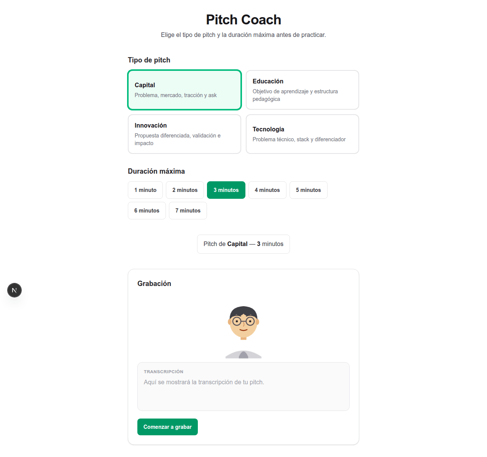
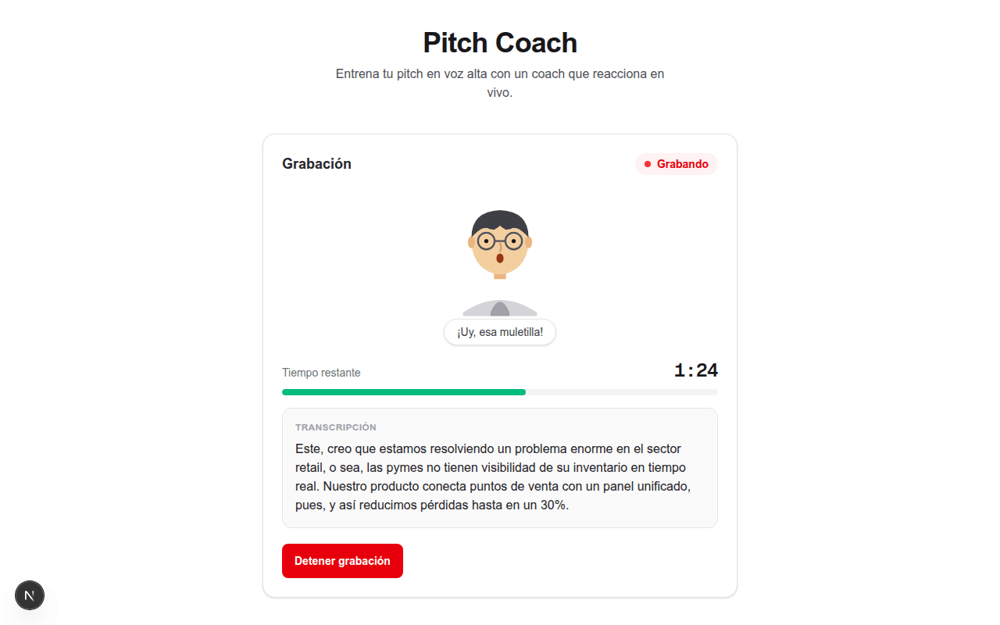
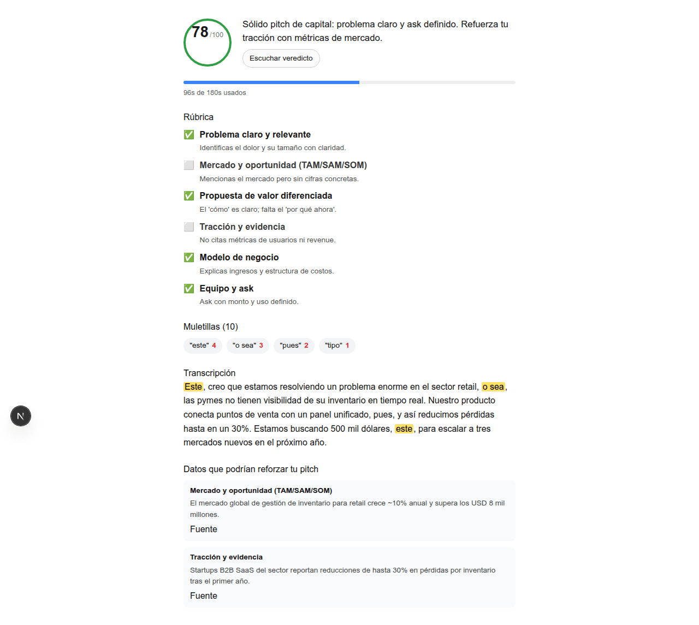

# Pitch Coach

Entrena tu pitch en voz alta y recibe feedback estructurado según el tipo
(capital, educación, innovación o tecnología): rúbrica, score, muletillas y un
veredicto que puedes escuchar cuando quieras. Interfaz y análisis en **español o
inglés** (LATAM-first).

Herramienta open source: puedes usarla, forkarla y madurarla como quieras.

Licencia: [MIT](LICENSE).

## Qué hace

**Loop principal:** eliges idioma, tipo y duración → grabas (MediaRecorder, corte
automático) → el servidor transcribe (ElevenLabs Scribe) → se cuentan muletillas →
el modelo evalúa contra la rúbrica (Nebius por defecto) → el dashboard muestra
score, puntos cumplidos/faltantes y transcripción resaltada.

**Extras en la misma sesión:**

- **Guion descargable** con marcas de tiempo por frase (`[mm:ss.cc]`) si grabaste
  (no si escribiste el texto a mano).
- **Escuchar veredicto** (ElevenLabs; fallback SpeechSynthesis).
- **Análisis Ultra** — reanálisis con razonamiento extendido y traza de pasos.
- **Resolver hallazgos** — hasta 3 preguntas de seguimiento sobre puntos no
  cumplidos (voz o texto de respaldo).
- **Sugerencias con dato real** (Tavily) cuando falta un punto de rúbrica, con
  validación y frase lista para decir en voz alta.
- **Tu progreso** — historial local (últimas 20 prácticas en este navegador).

Indicador de estado del coach en texto (`Escuchando…` / `Transcribiendo…` / frase
final), en el idioma de la sesión. Sesión anónima, sin login.

Demo en línea:
[https://pitch-coach-production-1c0c.up.railway.app](https://pitch-coach-production-1c0c.up.railway.app/).

Documentación del producto e implementación: [`docs/README.md`](docs/README.md).

## Capturas

| Selección del pitch | Coach (indicador) | Dashboard de resultados |
| :---: | :---: | :---: |
|  |  |  |

## Limitaciones conocidas

- **Tests unitarios, no de UI** — `npm test` (vitest) cubre `src/lib/` y rutas
  de API (fetch mockeado); el loop con micrófono se verifica a mano.
- **Sesión anónima** — el historial vive en `localStorage`; no hay cuentas ni
  sincronización entre dispositivos.
- **STT** — requiere `ELEVENLABS_API_KEY` (Scribe). Sin ella, o sin micrófono,
  hay campo de texto de respaldo.
- **Transcripción no en vivo** — grabar → detener → transcribir el clip completo.
- **Coach visual** — indicador de texto temporal; la animación (p. ej. esfera) está
  planificada para la fase de UX/UI.
- **Proveedores externos** — Nebius, ElevenLabs y Tavily tienen rate limits y
  dependen de internet; el TTS cae a SpeechSynthesis si falla ElevenLabs.

## Stack

- **Next.js 16** (App Router + API routes), **React 19**, **Tailwind CSS 4**
- **Nebius Token Factory** — análisis por defecto (`MODEL_PROVIDER=nebius`)
- **Gemini API** — contingencia manual (`MODEL_PROVIDER=gemini`)
- **MediaRecorder + ElevenLabs Scribe** — captura y STT server-side
- **ElevenLabs** — TTS (veredicto y preguntas de hallazgos)
- **Tavily** — enriquecimiento opcional del dashboard
- **Sentry** — errores y tracing (opcional; ver `.env.example`)
- **Railway** — deploy (`Dockerfile` solo producción)

## Setup local

Desarrollo nativo en Linux (sin Docker para el día a día).

1. Clonar el repositorio.
2. `npm install`
3. Copiar `.env.example` a `.env.local` y completar al menos:
   - `MODEL_PROVIDER` — `nebius` (default) o `gemini`
   - `NEBIUS_API_KEY` — **requerida** con Nebius (default)
   - `GEMINI_API_KEY` — **requerida** solo si `MODEL_PROVIDER=gemini`
4. Opcional pero recomendado para el loop completo:
   - `ELEVENLABS_API_KEY` — STT + TTS
   - `ELEVENLABS_VOICE_ID_*` — español e inglés (ver `.env.example`)
   - `TAVILY_API_KEY` — sugerencias en el dashboard
5. `npm run dev`

Navegador moderno con micrófono. HTTPS fuera de localhost para el micrófono.

**Comandos útiles:** `npm test`, `npm run lint`, `npm run build`.

## Deploy (Railway)

Build con `Dockerfile` (Next.js standalone) y `railway.toml`. Configura en
Settings → Variables las mismas keys que en `.env.local` (incluidas
`NEXT_PUBLIC_SENTRY_*` y `ARG` del Dockerfile si usas Sentry — ver
[`docs/sentry.md`](docs/sentry.md)).

## Documentación

| Documento | Para qué |
| --- | --- |
| [`docs/README.md`](docs/README.md) | Índice (tutorial, guías, referencia) |
| [`docs/alcance.md`](docs/alcance.md) | Producto, reglas de negocio, contratos |
| [`docs/status.md`](docs/status.md) | Qué está implementado y dónde vive en código |
| [`CONTRIBUTING.md`](CONTRIBUTING.md) | Contribuir y puntos de extensión |
| [`CLAUDE.md`](CLAUDE.md) | Reglas para agentes en el repo |

## Contribuir

Issues y pull requests son bienvenidos. Ver [`CONTRIBUTING.md`](CONTRIBUTING.md).

## Licencia

MIT — ver [LICENSE](LICENSE).
